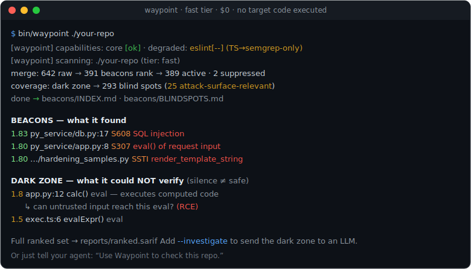
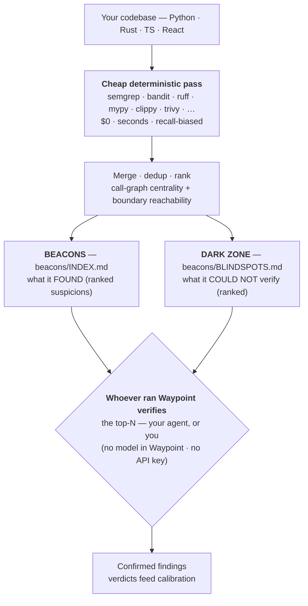
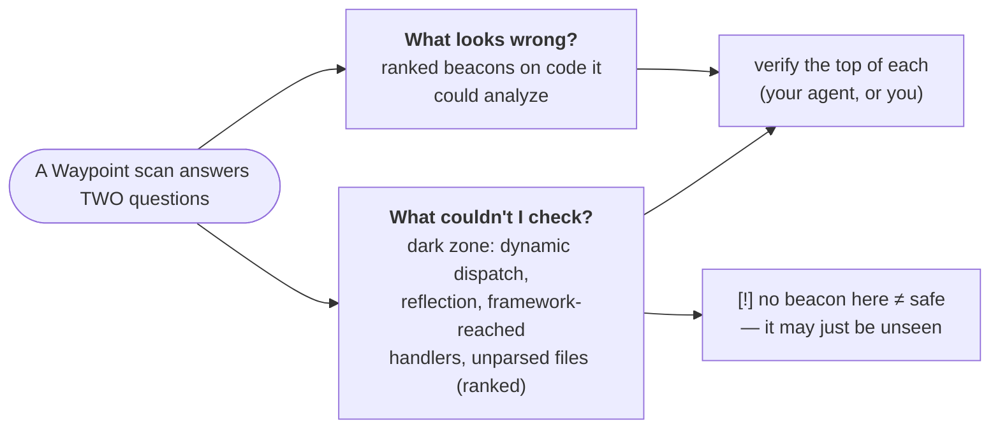

# Waypoint

> **Code triage for the AI era** — a $0, deterministic tool your coding agent runs to
> find what's wrong *and* surface what it *couldn't* check. No API key — the agent that
> drives it does the verifying.

[](https://github.com/colbyvk/waypoint/actions/workflows/ci.yml)


**Triage for the era of AI-generated code.** You (or your agent) now ship code faster
than anyone can review it. Waypoint is the cheap, deterministic layer that flags the
regions worth a second look — and, just as importantly, **tells you which regions it
*couldn't* vouch for**.

**It's a tool, not an agent.** Waypoint runs no model and **needs no API key**. The
agent that *drives* it — Claude Code, Cursor, or you at a terminal — reads the short,
scoped list it produces and verifies each item. Waypoint draws the map; the driver
already has the brain.

**Why not just run the linters?** Detection *is* commodity — Waypoint runs the linters
for you (Semgrep · Bandit · Ruff · mypy · Clippy · Trivy · …) plus a thin layer of
curated rules. Its edge is what a linter **can't** do: it merges every tool into **one
ranked list**, orders it by **reachability from an input boundary** (not just severity),
and — the part no linter gives you — emits a **dark-zone map**: the regions a static
pass *structurally could not analyze* (dynamic dispatch, reflection, framework-reached
handlers, unparsed files). A linter's silence is ambiguous; Waypoint tells you *"here's
what I couldn't check,"* so you never mistake a blind spot for safe. Each finding is a
**beacon** — a suspicion handed to whoever runs Waypoint (your agent, or you) to confirm.



*A fast-tier scan ($0, seconds): ranked **beacons** for what it found, plus the **dark
zone** for what it couldn't verify. Run it yourself with `examples/demo.sh`.*



The cheap pass never decides whether something is *actually broken* — only whether a
region is *worth attention*. The beacon is the handoff that turns the agent from an
explorer into a cheap, reliable **verifier**. The dark zone is the honesty most tools
skip — **a region with no beacon isn't proven safe; it may simply be unseen:**



**Design principle: assemble, don't build.** Everything hard (parsing, scanning,
taint tracing, optional headless verification) is delegated to mature open-source
tools. The custom surface is tiny on purpose — a few readable Python scripts, a
folder of Semgrep rules, and config — so a non-SWE team can own it.

**Does it actually find real bugs?** In a verification run across **7 public repos** —
opening every top beacon against the source — Waypoint led to **12 confirmed real
issues**: 11 distinct vulnerabilities in a deliberately-vulnerable app (SQLi, two RCE
paths, SSRF, XXE, command injection, weak session randomness, DoS) plus a genuine
`verify=False` TLS bug in httpie's shipping code. **77% of the top beacons were
genuine**; on mature libraries (Flask / requests / werkzeug / Django) it confirmed
**zero new defects** — the honest result for battle-tested code. Full method +
per-repo numbers: **[docs/VALIDATION.md](docs/VALIDATION.md)**.

---

## Quickstart — it's a command you point at a directory

**Boot up — three commands, copy-paste:**

```bash
git clone https://github.com/colbyvk/waypoint.git && cd waypoint
detectors/install.sh        # core scanners (required). add: --eslint (TS/React) · --all (everything)
bin/waypoint --doctor       # ← prints exactly which detectors are active + what each gap costs
```

`install.sh` **fails loudly** if the core (Python venv + Semgrep) can't install, and
the **doctor** — printed at the end of install, surfaced as `--doctor`, and shown as a
one-line banner on *every* scan — means a partial toolchain is never a silent surprise.
With just the default install you get Semgrep + Bandit + Ruff + mypy + pip-audit across
all four languages' custom rules; add `--eslint` for the full TS/React lane.

> **Platforms:** Linux and macOS natively (CI covers both, Python 3.11/3.12). On
> **Windows**, run inside **WSL2** or **Git-Bash** — the Python engine is OS-agnostic
> (file paths are normalized), but the `bin/` entrypoints are POSIX shell scripts.

**Scan:**

```bash
bin/waypoint /path/to/your/repo      # FAST tier (default): deterministic scanners only — seconds, $0
```

Results land in `beacons/INDEX.md` (ranked suspicions), `beacons/BLINDSPOTS.md`
(the **dark zone** — regions it could *not* verify), and `reports/ranked.sarif`.
Put it on your `PATH` with `ln -s "$(pwd)/bin/waypoint" /usr/local/bin/waypoint`.

> **Shipping an AI-built app and just want "is this safe?"** Don't run anything
> yourself — ask your coding agent: *"check if this is safe to deploy."* The bundled
> **[`deploy-check` skill](skills/deploy-check/SKILL.md)** runs `bin/waypoint <dir> --deploy`
> (a recall-biased pass for the risks that sink a fresh deploy — leaked secrets,
> exposed endpoints, injection, TLS-off, wildcard CORS) and hands you a plain-English
> 🔴 / 🟡 / 🟢 verdict + a short fix list. No jargon, no API key.

<details><summary><b>All the tiers &amp; flags</b></summary>

```bash
bin/waypoint <repo> --deploy          # "safe to ship?" — recall-biased deploy-risk profile + readiness rollup
bin/waypoint <repo> --changed         # incremental: only files changed vs git (+ cached baseline)
bin/waypoint <repo> --deep            # DEEP tier: CodeQL + logic lane — RUNS TARGET CODE (needs --i-trust-this-code)
bin/waypoint-sandboxed <repo> --deep  # ...or run untrusted code isolated (no network · read-only · non-root)
bin/waypoint <repo> --dispatch        # emit verifier-shaped prompts for YOUR agent (writes files; no model, no key)
bin/waypoint <repo> --investigate     # same, for the ranked DARK-ZONE blind spots
bin/waypoint <repo> --gate            # fail (exit 1) on policy-violating beacons (CI teeth)
bin/waypoint <repo> --logic           # the slow logic lane (mutation / race / fuzz / property-based testing)
bin/waypoint <repo> --codeql          # CodeQL cross-file taint (needs the CodeQL CLI)
bin/waypoint <repo> --all             # EVERYTHING: all detectors + logic lane + CodeQL
bin/waypoint <repo> --calibrate       # recompute per-rule precision from past verdicts, then rank
```
</details>

**Vibe-coding it — you never touch a flag.** Point your agent (Claude Code, Cursor,
Gemini, ChatGPT) at this repo. It reads [`skills/waypoint/SKILL.md`](skills/waypoint/SKILL.md),
runs the boot-up, scans, verifies the top beacons **and** the dark-zone gaps by reading
your code, and reports what's actually wrong in plain English — and tells you if a
missing detector left coverage partial.

### Use it from your agent (MCP — works across Claude, Cursor, Gemini, Codex)

Waypoint ships an **MCP server** ([`integrations/mcp/waypoint_mcp.py`](integrations/mcp/waypoint_mcp.py)),
so any MCP-capable agent drives the whole tool — no flags, no SARIF, no clone-and-symlink.
It exposes four tools: `waypoint_doctor`, `waypoint_scan`, `waypoint_beacons`, `waypoint_dark_zone`.

```bash
detectors/install.sh            # once — installs the MCP server too (pinned in requirements.txt)
```

- **Claude Code** — this repo is a plugin (`.claude-plugin/plugin.json`, bundling the skill +
  MCP) and ships a project `.mcp.json` that Claude Code auto-discovers. To wire it globally:
  `claude mcp add waypoint -- /abs/path/to/waypoint/bin/waypoint-mcp`
- **Cursor / Gemini / Codex / any MCP client** — add to your MCP config:
  ```json
  { "mcpServers": { "waypoint": { "command": "/abs/path/to/waypoint/bin/waypoint-mcp" } } }
  ```

Then just say: **"Use Waypoint to check this repo."** The agent calls `waypoint_scan`, pulls the
beacons + dark zone, verifies the top ones by reading your code, and reports — it never has to
know a flag exists.
Try it on the bundled, intentionally-vulnerable fixture:

```bash
bin/waypoint samples/monorepo        # see ranked beacons; bin/waypoint --test runs the suite
```

The four stages are also runnable individually (`detectors/run_all.sh`,
`detectors/merge_sarif.py`, `prioritise/rank.py`, `dispatch/fallback_dispatcher.py`)
— `bin/waypoint` just chains them with `--base` set to the directory you scanned.

---

## The beacon format is SARIF — there is no custom schema

Every detector emits (or is wrapped to emit) [SARIF 2.1.0](https://sarifweb.azurewebsites.net/).
A SARIF `result` already carries location, rule id, severity and message — it *is*
a beacon. Waypoint's extra fields live in `result.properties.waypoint`:

```jsonc
"properties": { "waypoint": {
  "axes": ["security", "abuse"],          // security | edge-case | concurrency | abuse | logic
  "severity_prior": 0.9,                   // the detector's cheap pre-agent guess
  "hypothesis": "string-built SQL into execute() — injection if input is untrusted?",
  "content_hash": "ca757c379a…",           // hash of the normalized region (for suppression)
  "merged_from": [ {"tool": "semgrep", …}, {"tool": "bandit", "rule_id": "B608"} ],
  "score": 1.42, "rank": 1, "boundary_reachable": true, "centrality": {…},
  // logic-lane beacons (property/fuzz) also carry the concrete failure:
  "property": "lo <= clamp(x) <= hi", "reproducing_input": "x=0, lo=0, hi=-1"
}}
```

Normalizing everything to SARIF is what lets the detectors, the merger, the
prioritiser, the suppression store, and the verification step all speak one language —
and findings render natively in the GitHub Security tab for free.

---

## Repository layout

```
waypoint/
├── bin/waypoint              # THE COMMAND: point it at a directory, get ranked beacons
├── bin/wipe-beacons          # clear the dropped beacons (beacons/*.md)
├── bin/waypoint-sandboxed    # run on UNTRUSTED code in a locked-down container (no net · ro · non-root)
├── Dockerfile                # the sandbox image
├── beacons/                  # dropped beacons land here on first scan: INDEX.md + <rank>_<hash>.md (run output, git-ignored)
├── skills/                   # VENDOR-NEUTRAL agent skills (symlinked into .claude/skills/ for auto-discovery)
│   ├── waypoint/             #   scan → verify → report (drives the full engine)
│   └── deploy-check/         #   "is it safe to ship?" — plain-English deploy verdict for vibe coders
├── waypoint.config.yaml      # which detectors run, budgets, thresholds, scoring
├── tag_map.yaml              # off-the-shelf rule id -> axes + agent hypothesis
├── infra/                    # detection infrastructure (rules + generated schema)
│   ├── core/                 # the SHIPPING rules (107) — precise + additive, language-first then classifier
│   │   ├── python/{security, logic, iac}/        # iac = AWS-CDK rules
│   │   ├── react/{security, logic}/
│   │   ├── rust/{security, logic}/
│   │   └── typescript/{security, logic, iac}/
│   ├── experimental/         # retired recall-biased proxies (concurrency/abuse/edge-case/authz) — OFF by default
│   └── schema-infra/         # README = shared beacon schema; per-beacon docs generated on demand (git-ignored)
├── detectors/
│   ├── install.sh            # venv + scanner install
│   ├── run_all.sh            # run every tool -> per-tool SARIF (skips missing tools)
│   ├── run_logic.sh          # opt-in logic lane: mutation / race / fuzz / property-based testing -> `logic` beacons (with reproducing input)
│   ├── sariflib.py           # the one place we read/write SARIF + hash regions
│   ├── merge_sarif.py        # merge, tag, dedup -> one beacon file
│   ├── normalize/            # wrappers: semgrep/bandit/pip-audit/clippy/geiger/mypy -> SARIF
│   └── gen_schema_infra.py   # generate the infra/schema-infra/ beacon docs from the rules
├── hazards/                  # plain-English hazard catalog — the source of truth for rules
├── prioritise/
│   ├── rank.py               # the weighted score (§7)
│   └── suppress.py           # content-hash store + allowlist (§9)
├── dispatch/
│   ├── fallback_dispatcher.py# assemble envelope + verifier prompts (optional · headless)
│   └── raptor/               # integration with the optional RAPTOR harness
├── suppression/
│   ├── store.json            # content-hash -> verdict + expiry (agent-written)
│   └── allowlist.yaml        # human-accepted patterns (justification + expiry required)
├── samples/monorepo/         # intentionally-vulnerable Py/Rust/React/TS test fixture
├── tests/                    # pytest: verifies the custom layer with NO external scanner
├── docs/                     # demo.svg + dev docs (PLAN.md roadmap, DECISIONS.md owner choices)
└── .github/workflows/        # CI: deterministic scan per-PR, agent triage on a schedule
```

---

## The pipeline, stage by stage

| Stage | Command | What it does | AI? |
|---|---|---|---|
| Collect | `detectors/run_all.sh` | run each tool → `reports/<tool>.sarif` | no |
| Merge | `detectors/merge_sarif.py` | tag axes + hypothesis, dedup overlapping regions, hash | no |
| Rank + suppress | `prioritise/rank.py` | score (§7), drop suppressed/allowlisted beacons | no |
| Coverage | `prioritise/coverage.py` | derive + rank **blind spots** (regions the graph can't verify) → `beacons/BLINDSPOTS.md` | no |
| Dispatch | `dispatch/fallback_dispatcher.py` | top-N beacons → verifier prompts for your agent → verdicts | optional |
| Investigate | `… --investigate` | top-K **blind spots** → verifier prompts for your agent → verdicts | optional |

The deterministic stages (collect → merge → rank) are independently useful and
fully reproducible. The raw per-tool SARIF in `reports/` is the auditable record
of *what fired*; the agent's verdicts (`reports/verdicts.json`) are a **separate**
record of *what was concluded* — the two are never collapsed.

### Scoring (`prioritise/rank.py`, spec §7)

```
score = severity_prior
      + multi_axis_bonus            (if the beacon has >1 axis — the strongest cheap signal)
      + centrality_weight * normalized_caller_count
      + boundary_bonus              (if reachable from an input/trust boundary)
```

All weights live in `waypoint.config.yaml` → `scoring`. It is deliberately simple
and explainable; it is **not** ML. Known low-value third-party rules (asserts,
style, perf) are capped via `rule_prior_overrides` so the boundary/multi-axis
bonuses can't float them above genuine security/logic findings.

`centrality` and `boundary_reachable` come from a **real call graph**
([prioritise/callgraph.py](prioritise/callgraph.py)) — distinct-caller fan-in and a
BFS from trust-boundary entrypoints — so a region is ranked on *proven*
reachability (`boundary_source: call-graph`), falling back to the text/glob
heuristic only when a symbol isn't in the graph. A per-rule **precision
multiplier** ([prioritise/calibration.py](prioritise/calibration.py)) learned from
past agent verdicts then down-weights rules that keep getting dismissed and boosts
ones that get confirmed (neutral until verdicts accumulate; recompute with
`--calibrate`). CodeQL cross-file taint is an opt-in lane
([detectors/run_codeql.sh](detectors/run_codeql.sh), `--codeql`/`--all`).

### Suppression (`prioritise/suppress.py`, spec §9)

- When an agent **dismisses** a beacon, its region's content hash + verdict are
  stored in `suppression/store.json`. On later runs that beacon is suppressed —
  **until the region's code changes** (the hash is over normalized region text, so
  an edit re-raises it) **or the suppression expires** (default 90 days).
- `suppression/allowlist.yaml` holds human-accepted patterns; every entry requires
  a written justification and an expiry date.

### Advanced — headless verification (only when *no* agent is present)

**You almost never need this, and by default it needs no key.** Normally the agent
that runs Waypoint *is* the verifier — it reads `beacons/INDEX.md` +
`beacons/BLINDSPOTS.md` and confirms each item itself, at no extra cost. `--dispatch`
and `--investigate` exist only for **unattended** runs (a pipeline with no agent
driving): they assemble each beacon's context envelope into a **verifier-shaped**
prompt — "here is a hypothesis, here is the code, prove or disprove," never "find bugs
in this repo."

By default they call **no model** and use **no key** — they just write the prompts to
`reports/dispatch/` for any agent to pick up. If you have no agent at all and want
Waypoint to produce verdicts itself, an optional backend can call one — **this is the
only place an API key is ever used, and it is never required:**

| `dispatch.backend` (`waypoint.config.yaml` or `--backend`) | calls a model? | key? |
|---|---|---|
| `dry-run` *(default)* | no — writes prompts to `reports/dispatch/` | **none** |
| `claude-cli` | shells out to your local `claude` CLI | the CLI's own auth |
| `anthropic-api` | calls the Anthropic API | `ANTHROPIC_API_KEY` |
| RAPTOR | hands the ranked beacons to a [RAPTOR](dispatch/raptor/README.md) harness | per that harness |

### The learning loop — works with no key

Calibration is **neutral until it has verdicts**, then turns them into per-rule score
multipliers (dismissed rules sink toward `min_factor`; confirmed ones rise toward
`max_factor`, `waypoint.config.yaml` → `scoring.calibration`). It reads verdicts from
**whoever verified** — your agent, your own dismissals in `suppression/store.json`, or
the optional headless backend above. So the loop itself needs **no API key**:

```bash
# normal path: your agent (or you) verifies; dismissals land in suppression/store.json, then:
bin/waypoint <repo> --calibrate     # verdicts → per-rule multipliers; next scan ranks sharper on THIS repo
```

### Coverage / blind-spot map — the "dark zone" (`prioritise/coverage.py`)

Beacons say what the deterministic pass *found*. The blind-spot map says, more
honestly, what it **could not reason about** — so the *absence* of a beacon there
is not evidence of safety. Today a region with no beacon is ambiguous: clean, or
simply *unseen* (dynamic dispatch, reflection, framework-registered handlers,
files that failed to parse). Every scan now also emits `beacons/BLINDSPOTS.md`,
derived from the call graph, surfacing three gap kinds:

- **dynamic-dispatch** — `getattr`/`eval`/`exec`/computed-call sites (control flow
  became data; the graph can't follow it). Reflection with a *literal* target is
  excluded — only the genuinely computed forms count.
- **orphan-callable** — a defined function with **no in-graph caller** that isn't a
  recognized entrypoint: reached via framework / registration / reflection, or dead.
- **unparsed-file** — the analyzer couldn't read the file at all (zero coverage).

**It does not fake a severity for what it didn't read.** Each gap is placed into a
**categorical tier from OBSERVED facts only** — `code-exec-adjacent` (the parsed body
calls `exec`/`eval`/deser, or the dispatch itself executes code) > `sink-adjacent`
(a sql/io/net sink) > `opaque` (computed dispatch / orphan, *no* observed sink) >
`unparsed` (couldn't read it). **Reachability is `UNRESOLVED` by definition** — that's
why it's dark. Name-shape and trust-boundary path are weak *hints* that only break
ties *within* a tier; **opaque and unparsed regions are counted, never graded** (we
don't grade what we didn't traverse). Test/vendor code is excluded.

And it states a **guarantee** every run — the **coverage partition**:

> *N functions — X analyzed (parsed + reachable), Y dark (all listed). `analyzed ∪
> dark = all`, `analyzed ∩ dark = ∅`, asserted at runtime. The call graph is
> conservative: an unresolved/computed/un-boundable edge never marks a target
> reachable — we err DARK. Nothing is silently assumed safe.*

So the dark zone is the **provable complement** of what we checked, not a ranked
guess at it. (Sound enumeration for Python via `ast`; conservative best-effort for
TS/Rust — see **[GUARANTEES.md](GUARANTEES.md)** for the full, honest ladder.)

`waypoint <dir> --investigate` sends the **observed-adjacent** tiers (code-exec /
sink) to the verifier — the deliberately **expensive** pass — each with a *scoped*
question, never "audit this." Verdicts feed the same calibration store as beacons.

---

## Languages & detectors

Four languages, all required: **Python, Rust, React (TS/JSX), TypeScript**.

| | Python | Rust | React/TS |
|---|---|---|---|
| pattern / custom rules | Semgrep | Semgrep | Semgrep |
| security | Bandit | (house Semgrep) | eslint-plugin-security |
| correctness / edge | Ruff, mypy | Clippy | ESLint, typescript-eslint |
| concurrency | OSS packs *(opt-in)* | cargo-geiger | react-hooks |
| dependencies | pip-audit | cargo-audit | osv-scanner / npm audit |
| cross-cutting | Gitleaks + **TruffleHog (verified, live secrets)**, Trivy (CVEs/IaC), optional CodeQL (cross-file taint) | | |

Tools that don't emit SARIF natively are wrapped in `detectors/normalize/` (Semgrep
is wrapped too — its SARIF exporter drops our custom metadata, so we read its JSON).
**Detection is assembled, not built.** The shipping default is **107 curated rules** in
[infra/core/](infra/core/README.md) — the genuinely *additive* ones: **taint-mode
dataflow** (source → sink, which a linter doesn't give you for free), precise
**security** rules (injection · crypto · secrets · deserialization · SSRF · XSS),
low-false-positive **logic** rules, and **IaC / AWS-CDK** misconfig. The recall-biased
*proxy* rules (concurrency · abuse · edge-case · authz) were **retired to
[infra/experimental/](infra/experimental/README.md)** — [real verification](docs/VALIDATION.md)
showed they produced most of the false positives while catching nothing the precise
rules + off-the-shelf linters miss. For broad commodity coverage, **assemble OSS packs**
(below) instead. See [hazards/](hazards/README.md) for the plain-English catalog and
[infra/schema-infra/](infra/schema-infra/README.md) for the per-beacon schema.

**Sound call graph & dataflow.** The dark-zone coverage frontier uses stdlib `ast`
for Python and **tree-sitter** for TS/JS/Rust — sound syntactic enumeration (regex
fallback if tree-sitter isn't installed; `--doctor` shows which). **Taint-mode**
Semgrep rules add free *intra-file* dataflow (source → sink with sanitizers);
`--deep`/CodeQL adds *cross-file* taint. See [GUARANTEES.md](GUARANTEES.md).

**Commodity coverage = curated OSS packs (assemble, don't build).** For the broad
detection the retired proxies approximated, point Semgrep at battle-tested community
packs — no new dependency, nothing to maintain:
`SEMGREP_EXTRA="p/owasp-top-ten p/secrets p/python p/javascript p/react" bin/waypoint <repo>`
Vendor them once (clone the rule dir, pass a local path) for offline + reproducible scans.

---

## Security & threat model

Waypoint scans potentially **untrusted** code, so the key question is *which tiers run that code*:

| Tier | Runs the scanned code? | Safe on untrusted code? |
|---|---|---|
| **fast** (default) / `--changed` | No — static only | [x] |
| `--codeql` | No — database extraction | [x] |
| `--logic` / `--deep` | **Yes** — the target's tests, fuzzers, build scripts | [!] gated — use the sandbox |

Hardening: the static tiers run **Waypoint's own** ESLint/mypy config (`--no-config-lookup`, `--config-file`), never the scanned project's (which could import plugins = code execution); `--logic`/`--deep` **refuse** unless `--i-trust-this-code` / `WAYPOINT_TRUSTED=1`; untrusted deep scans belong in the container — `bin/waypoint-sandboxed <dir> --deep` (no network · read-only source · non-root · ephemeral); the CodeQL installer verifies the bundle's **SHA-256** (fail-closed); Waypoint is **read-only on your source** and **redacts detected secrets** from beacons (but raw `reports/` may contain sensitive matches — it's git-ignored; don't share it); path resolution is **contained to the scanned tree** (no `..`/symlink escape). Full policy + disclosure: [SECURITY.md](SECURITY.md).

## CI (optional)

Waypoint is primarily a command you run against a directory — CI is just one place
to run that command. If you want it, the **optional** [`.github/workflows/waypoint.yml`](.github/workflows/waypoint.yml)
runs the deterministic scan on push/PR and uploads SARIF to the Security tab —
**no API key, no AI** (spec §12). It also carries a commented-out, fully optional
*headless triage* job for the rare case of an unattended pipeline with no agent
present; that block is the only thing that would touch a key, and it ships disabled.
Delete the file if you don't use GitHub — nothing else depends on it.

---

## Decisions left to you

Five choices are the owner's to make (repo host, agent model + budget, whether
CodeQL runs, suppression expiry + allowlist sign-off, monorepo vs per-service).
They are written up with current defaults in [DECISIONS.md](docs/DECISIONS.md).

## Tests

```bash
.venv/bin/python -m pytest tests/ -q
```

The suite verifies the custom layer (hashing, merge/dedup, scoring, suppression,
dispatch) with crafted fixtures and **no external scanner** — so you can trust and
maintain the code without debugging a third-party engine.
